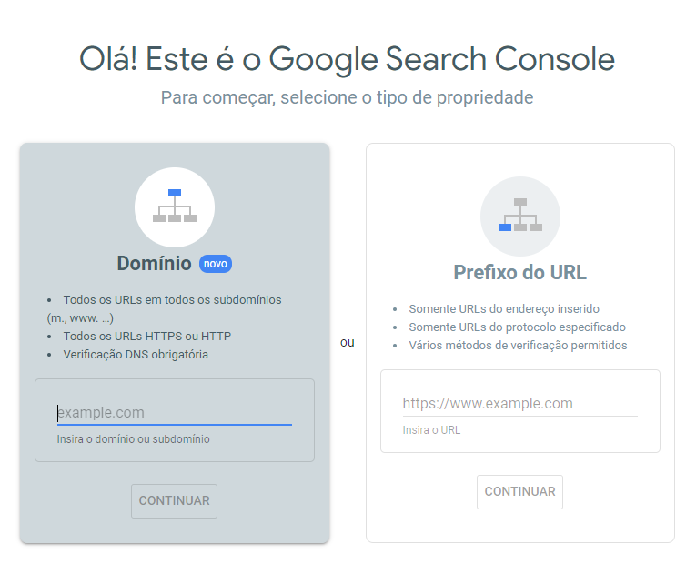
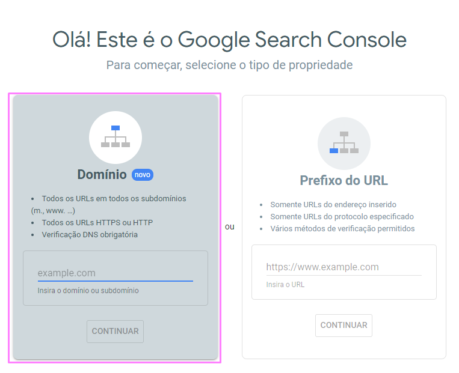
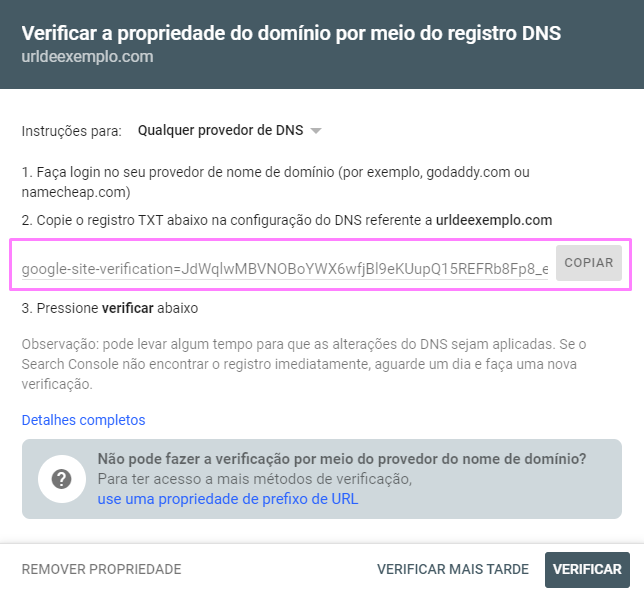
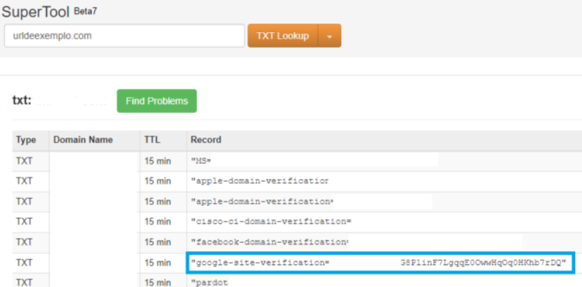
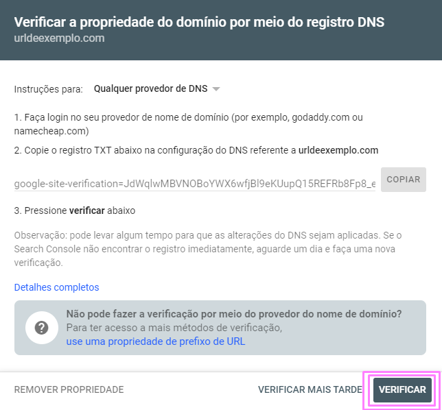
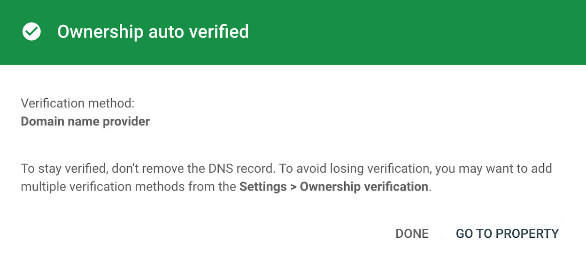

# **Configuração inicial do Google Search Console**

### **Introdução:**
> 📢 Esse documento é um tutorial rápido para configurar o Google Search Console no DNS do site.

 

[Na página inicial do Google Search Console](https://search.google.com/search-console/welcome) são oferecidas duas formas de inserção de URL.

- No bloco da esquerda, está a implementação a nível de domínio. Isso significa que todas as versões do domínio serão monitoradas, ou seja, páginas com www e sem www, páginas com https e http, além dos subdomínios existentes.

- No bloco da direita, existe a opção de monitoramento de um URL específico. É uma forma menos abrangente de monitoramento, que pode ser utilizada em casos pontuais.

  

    

  

Para SEO, é importante que tenhamos o monitoramento do domínio inteiro. Portanto, vamos configurar através do bloco da esquerda.

 

> 📢 Com esse tipo de monitoramento, é possível identificar inconformidades em todas as páginas do domínio, sejam erros técnicos como páginas retornando erro 404 (página inexistente), ou duplicidade de URLs, por exemplo. É recomendado planejar uma auditoria do domínio após a configuração do Google Search Console.

  

## **Primeiros passos para a inclusão de domínio**

1. No bloco da esquerda, deve-se inserir o domínio a ser monitorado. Importante seguir o formato *exemplo.com.br*, excluindo complementos como “www” ou “https://”.
    

    

  

Após clicar em “Continuar”, surgirá uma janela com 3 orientações que devem ser seguidas para completar a verificação, além de um código chamado “*registro txt*”, que está destacado em azul na imagem abaixo:

    

  

É preciso copiar o *registro txt* fornecido pela ferramenta e compartilhar com o time responsável pelo desenvolvimento do site. Esse time deverá incluir o *registro txt* no DNS provedor do domínio.

 

#

### **🧩 Orientação para o time de tecnologia responsável pelo site:**
- Incluir o registro txt, fornecido pela agência, no DNS provedor do domínio.
- Após, retornar ao time da agência que o processo foi concluído para que seja feita a validação da implementação.
#

  

## **Como validar a implementação:**

Existem ferramentas online que possibilitam verificar os registros TXT presentes no DNS de determinado domínio. O [MX Toolbox](https://mxtoolbox.com/SuperTool.aspx) atende nossa necessidade para essa verificação.

 

1. O primeiro passo é incluir a URL do site a ser verificado no campo em branco e selecionar “TXT Lookup” dentre as opções da caixa amarela, à direita: 

 

    

 

2. Todos os registros presentes nesse DNS serão listados em uma tabela. É preciso identificar se o registro TXT que o Google Search Console nos forneceu está aparecendo nesta lista.

`O início do código do registro TXT começará com "google-site-verification", como no exemplo abaixo.`

 

    

  

3. Ao identificar o registro TXT através do Toolbox, é preciso finalizar a verificação no Google Search Console. Basta clicar em "Verificar", destacado na imagem abaixo:

 

    

  

- Caso o registro tenha sido corretamente inserido no DNS, o Google Search Console estará pronto para uso! Essa é a mensagem devolvida pela ferramenta:

 

    

